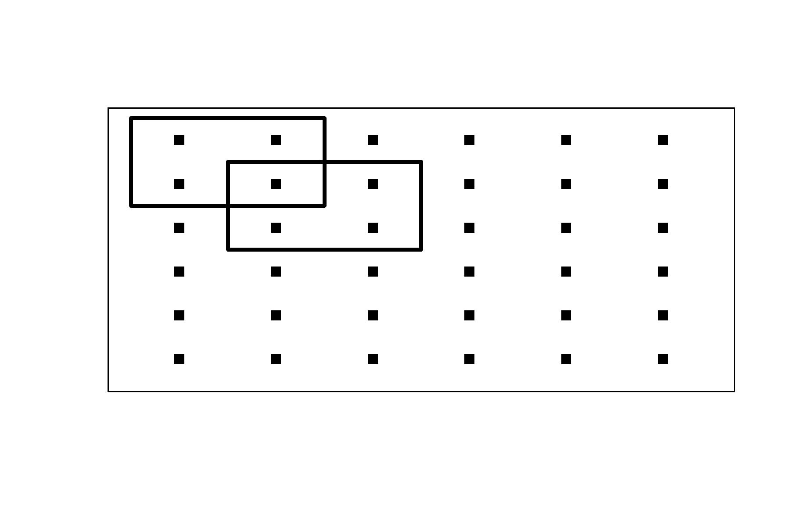

# Estimators {#estimatrs}

## Simple Random Sample (design-based)
The simplest approach is to treat the data as if all points were collected from a SRS design, and to use the usual SRS variance estimator,

\begin{equation}\label{eq:srs_var}
\widehat{\rm var}_{srs}(\bar{y}) = \frac{s^2_y}{n} = \frac{1}{n(n - 1)}\sum\limits_{i=1}^n \left(y_i - \bar{y}\right)^2 \ .
\end{equation}

Several simulation studies have demonstrated that this estimator tends to over-estimate the true variance, and the over-estimation can be substantial when positive autocorrelation exists [@fewster2011variance; @dunn1993two].

## Post-stratification (design-based)
This class of estimators was proposed by @wolter1984investigation and has been extended to systematic spatial surveys e.g., @dunn1993two @fewster2011variance, @millar1995abundance. Each stratum contains a fixed number of neighbouring sampled units from the systematic design, and the stratified random sample variance estimator of $\bar{y}$ is used [@fewster2009estimating] (this is ad-hoc because stratified designs assume simple random sampling within strata). [@millar1995abundance] provided a variation on this approach, by showing that it could be applied using strata that overlapped. 

Consider \(H\) overlapping strata where \(h = (1,2,\dots,H)\) index the strata, and let stratum \(h\) contain \(n_h\) sampling units  
(in this case \(n_h = 4\) in Figure~\ref{fig:overlapping_post}). %Delete or add Figure
Let the set of sampling units in strata \(h\) be denoted by the set \(S_h\). Then the post-stratified estimate of variance is

\begin{equation}\label{strata_var}
\widehat{\rm var}_{str}(\bar{y}) = \sum\limits_{h = 1}^H w_h^2 \frac{s^2_h}{n_h} \ ,
\end{equation}

where
\[
s^2_h = \frac{1}{n_h-1} \sum\limits_{i \in S_h} (y_i - \bar{y_h})^2, \text{ and } w_h = \frac{n_h}{\sum_h n_h} \ . 
\]
This formulation follows from @millar1995abundance and assumes overlapping strata. However, there are alternative overlapping and non-overlapping post-stratified variance estimators (see @d2003estimating). These alternative estimators are due in part to their original application for one dimensional systematically sampled data [@wolter1984investigation]. As discussed by @d2003estimating, extending these one-dimensional estimators to two-dimensions is not straightforward.

{#fig:overlapping width=50%}

## Correlation adjustment (hybrid)
Defined in @wolter1984investigation and investigated for spatial systematic samples [@ambrosio2003systematic; @strand2017study; @brus2016approximating; @mcgarvey2016precision], this estimator makes an adjustment to \(Var_{srs}(\bar{y})\) (Equation~\ref{eq:srs_var}) based on the amount of spatial auto-correlation that exists in the systematic sample.

\begin{align}\label{eq:adjust_corr}
\widehat{\rm var}_{adj}(\bar{y}) =&  \widehat{\rm var}_{srs}(\bar{y})  \bigg[1 + \frac{2}{ln({\rho})} + \frac{2}{({\rho}^{-1} - 1)}\bigg]& \text{if }{\rho} > 0\\
=& \widehat{\rm var}_{srs}(\bar{y})& \text{if }{\rho}  \leq 0 \ .\nonumber
\end{align}
%,
Here, \({\rho}\) is often substituted for by an estimate of global spatial-autocorrelation such as the commonly used Morans I \citep{anselin1995local}. 

## Boxlet estimator (hybrid)
The boxlet method proposed by @fewster2011variance} fits a density surface to the spatial domain $\mathcal{D}$ using a two-dimensional generalised additive model (GAM) [@wood2017generalized]. For any possible location, $b$, of the first quadrat, this enables calculation of the expected total count within the sampled quadrats, $\eta_b$ and within $\mathcal{D}$, $\eta_\mathcal{D}$. This calculation is done using finite approximation over a fine lattice within $\mathcal{D}$ (these lattice points correspond to the centroids of the so-called boxlets).  Let $p_b=\eta_b/\eta_\mathcal{D}$ denote the proportion of the expected total count that is expected within the sampled quadrats.

Let $y^+=\sum_{i=1}^n y_i$ be the number of individuals counted in the systematic sample. The boxlet method partitions the variance of $y^+$ using the law of total variance (Equation~\ref{eq:tot_var}).
The first term (${\rm var}_b(E[y^+|b])$) is the variance in the expected value of $y^+$ due to the possible starting position, $b$, of the first quadrat. The second component (\(E_b[{\rm var}(y^+|b)]\)) quantifies the expected (over $b$) magnitude of the variability in $y^+$ for a given $b$,

\begin{equation}\label{eq:tot_var}
{\rm var}(y^+) = {\rm var}_{b}(E[y^+|b]) + E_{b}[{\rm var}(y^+|b)] \ .
\end{equation}

Under the assumption that the counts in each quadrat are Poisson distributed, then given $b$ it follows that $y^+$ is binomially distributed according to a ${\rm Bin}(N,p_b)$ distribution. This gives
\begin{align}
{\rm var}(y^+) &=  {\rm var}_{b}(N p_b) + E_{b}[Np_b(1 - p_b)] \nonumber \\
&=  E_{b}[N^2 p_b^2] + E_{b}[N p_b]^2 
+ E_{b}[Np_b(1 - p_b)] \label{eq:BoxletVar} \ .
\end{align}

The boxlet method estimates (\ref{eq:BoxletVar}) by substituting $N$ with  $\widehat{N}$, and numerically evaluating the $E_b$ and ${\rm var}_b$ terms (that is, with respect to variability in $p_b$) over all boxlet centroids within the scope of placement of the first quadrat. This leads to the boxlet variance estimator $y^+$ and hence for $\bar{y}$, 
\begin{equation}
\widehat{\rm var}_{box}(\bar{y}) =  \frac{\widehat{\rm var}_{box}(y^+)}{n^2}
\end{equation}

## Geostatistical model-based estimator (model-based)

The geostatistical model-based approach partitions the spatial domain $\mathcal{D}$ into $m >> n$ quadrats, with abundances (at the time of the survey) of \( \boldsymbol{y}=\{y_i, i= 1, \dots, m\}\), and hence $N=\sum_i^m y_i$. The abundances are assumed to be a realisation from a model,
\begin{equation*}
	\boldsymbol{y} \sim f\left(\boldsymbol{X}, \boldsymbol{\theta}\right) \ ,
\end{equation*}

with auxiliary covariates denoted by \(\boldsymbol{X}\) and model parameters denoted by \(\boldsymbol{\theta}\). This natural incorporation of auxiliary covariates is often viewed as an advantage for the model-based approach [@johnson2010model;@chambers2012introduction;@staahl2016use;@shelton2014spatial]. 

Let $\Omega$ be the index of the set of $n$ sampling units selected by the systematic survey. The estimate of total population can be decomposed as
\begin{equation}
\widehat{N} = \sum\limits_{i \in \Omega} y_i + \sum\limits_{j \notin \Omega} E[y_j| y_i, i \in \Omega] \ .
(\#eq:total_estimator)
\end{equation}
The $y_i, i \in \Omega$ are known and so inference on un-sampled units $y_j, j \notin \Omega$ is the goal. 

Geostatistical models have been used with systematic surveys primarily in the acoustic literature @walline_07; @simmonds1996better but also in land cover use @aune2014comparison. These studies used kriging equations for model inference, which differs from the SPDE approach @lindgren2011explicit that is used for geostatistical models presented here (see Chatper 7 @gomez2020bayesian and @chang2015spatial for more detail on the difference between these two approaches). The SPDE approach was chosen for its flexibility in response variable distributions, flexibility in incorporating spatio-temporal GFs, ease of including covariates and availability of convenient software for its implementation, i.e. INLA @rinla_ref.

The software chosen to implement the spatial model, and estimator for the total population (Equation~\@ref(eq:total_estimator)) and corresponding variance was Template Model Builder (TMB) [@tmb]. TMB was chosen for its ease of implementing bespoke models (Equation~\@ref(eq:total_estimator) only involves using a subset of fitted values) and computational speed \citep{muff2020accounting} required for the purpose of performing 1\ 000's of simulations. TMB also has many inbuilt features that enhance its applicability. This includes automatic calculation of standard errors for functions of parameters using Taylor series expansion, which is commonly known as the generalised delta-method @millar2011maximum;@fournier2012ad). TMB also includes the "epsilon" method of bias correction [@tierney1989fully;@thorson2016implementing], which approximates the integral that equates to the expectation of non-linear functions of random-effect variables. @thorson2016implementing showed the "epsilon" method to be superior to other bias correction methods commonly used within fisheries models for estimating abundance. Using these estimators of variance, TMB will automatically report estimates of \({SE}\left[\widehat{N}\right]\). 

For spatially variable populations it is often better to estimate and provide standard errors for \( \log \widehat{N}\), which has generally been found to be more quadratic @bolker2013strategies. When \( \log \widehat{N}\) is of focus, confidence intervals are

\begin{equation}
	CI_{95\%} =	exp \left(\log \widehat{N} \pm 1.96 \ \widehat{SE}\left[\log \widehat{N}\right]\right) \ .
\end{equation}

Considerations when using model-based estimators include; assessing sensitivity to starting values, model convergence, model selection, goodness of fit, etc. As in all regression analysis, these are expected for any valid inferences.

