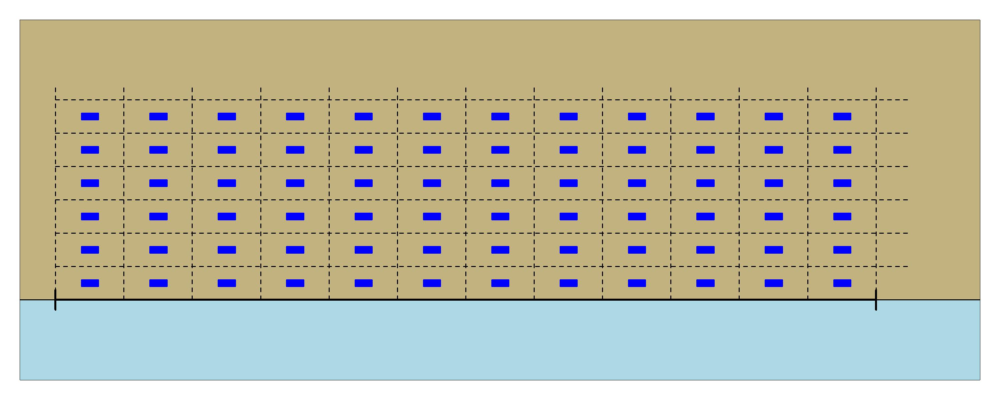

--- 
title: "Two-dimensional systematic survey estimators"
author: "C.Marsh"
date: "`r Sys.Date()`"
site: bookdown::bookdown_site
documentclass: book
bibliography: [book.bib, packages.bib]
url: craig44.github.io/systematicsurvey/
# cover-image: path to the social sharing image like images/cover.jpg
description: |
  This bookdown describes some estimators for two-dimensional systematic surveys and how to use them with the systematicsurvey R package.
link-citations: yes
github-repo: https://github.com/Craig44/systematicsurvey
---

# Two dimensional systematic surveys
Two-dimensional systematic surveys are a commonly applied survey design for estimating the abundance of spatial populations [@millar1995abundance; @fewster2011variance]. Systematic surveys enforce a uniform sampling pattern over the entire spatial domain. Unlike random sampling, systematic surveys avoid over and under sampling space.


Systematic surveys can have the advantage over random sampling strategies of being more practical to implement, and in simulation studies, the estimated population density has been shown to provide considerably lower variance than random designs under many conditions e.g., @mcgarvey2016precision. However, the most common systematic survey design consists of just a single primary sampling unit (PSU) and consequently there is no applicable design-based estimator of this variance. This has led to the development and application of several approximations based on variations of design-based variance estimators designed for random sample designs [@wolter1984investigation; @d2003estimating]. 


{#fig:sys_survey width=50%}


{#fig:single_draw  width=50%}


Consider a spatial survey region \(\mathcal{D} \subset \mathbb{R}^2\) of area $A$. For simplicity \(i\) indexes a sampling unit (quadrat) that is spatially referenced by coordinates in \(\mathcal{D}\). A two-dimensional systematic survey that is based on a single PSU requires the specification of the location of the first sampling unit, from which the location of all other sampling units are deterministically specified. The response variable in this setting is either numbers (abundance) or weight (biomass) in each of the $n$ sampling units denoted by \(\boldsymbol{y} = (y_1,y_2,\dots, y_n)^T\).

The population characteristic of focus is the total population within the survey region, denoted by $N$, or equivalently the mean density over $\mathcal{D}$, $d_\mathcal{D}=N/A$. 
If $\alpha$ is the area of each sampling unit then $y_\mathcal{D}=\alpha d_\mathcal{D}$ is the expected mean value.
Then, $N=\kappa y_\mathcal{D}$ where $\kappa=A/\alpha$ is the inverse of the sampling fraction.
Design-based methods applied to systematic surveys all use the sample mean estimator of $y_\mathcal{D}$, $\bar{y}=\sum\limits_{i = 1}^{n} y_i/n$, and hence the estimator $\widehat{N}=\kappa \bar{y}$ of $N$, with variance estimator


\[
\widehat{\rm var} \left(\widehat{N}\right) = \kappa^2 \widehat{\rm var}(\bar{y}) \ .
\]


In systematic surveys with multiple PSUs the systematic design-based variance estimator ($\widehat{\rm var}_{sys}(\bar{y})$) is known \citep{madow1944theory} and follows,
\begin{equation*}\label{eq:exact_var}
\widehat{\rm var}_{sys}(\bar{y}) = \frac{1}{B}\sum\limits_{b = 1}^{B} \left(\bar{y}_{b} - \bar{y}\right)^2 
\end{equation*}
where, $b=1,\dots,B$ are the PSUs, each assumed to contain the same number of sampling units, and $y_b$ is the sample mean within PSU $b$.
However, $B$ is typically a relatively small number, so this estimated variance generally has few degrees of freedom.

%,
For the systematic design of interest in this study there is just a single PSU (the position of the first quadrat) and hence no design-based variance estimator exists. For this reason, as shown below, some authors have explored the use of the simple random sampling (SRS) variance estimator, ad-hoc estimators utilizing stratified random survey variance estimators [@millar1995abundance; @strand2017study] and adjusted SRS variance estimators [@ambrosio2003systematic; @strand2017study; @brus2016approximating; @mcgarvey2016precision].


```{r include=FALSE}
# automatically create a bib database for R packages
knitr::write_bib(c(
  .packages(), 'bookdown', 'knitr', 'rmarkdown'
), 'packages.bib')
```
